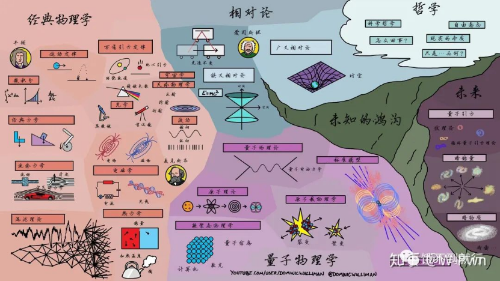
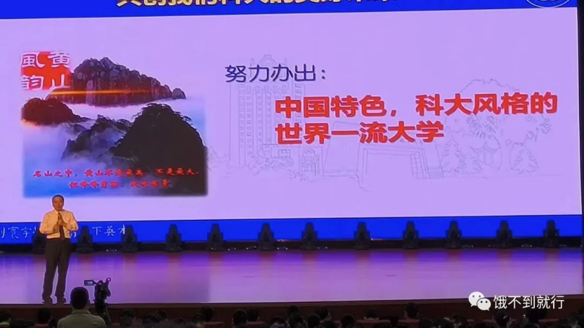
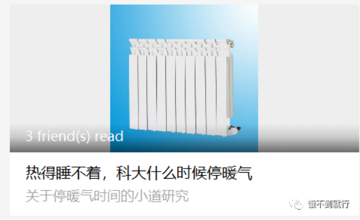
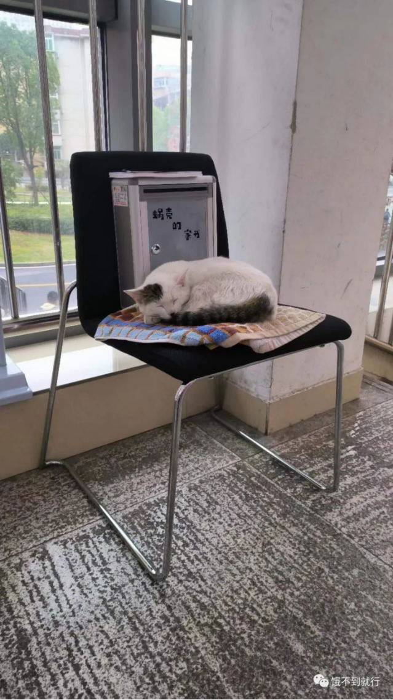

# 大一生活感悟

By Li Yonggen (lyg0501@mail.ustc.edu.cn)

每当新的学期开始，我都习惯对过去的一学期进行总结，这次我想写在大一第一学期中，我在中国科大所看到的点滴。

## 丁老师
丁老师每次进课室，都背着一个厚厚的大书包，微低着头，脚步挺快，活似远方赶来的旅者，风尘仆仆。拿起黑板擦拍几下，甩干净粉笔灰，口罩一摘，插裤兜儿里，便开始上课。

但他的口罩总是没插好，露出半截。于是在他背过去写板书，粉笔强烈地撞击黑板的时候，口罩便与之同频共振，肆意抖动飞扬。老师胖胖的，口罩飘飘的，让我觉得憨憨的。内心前一秒笑得咯咯的，后一秒便折服于其痴痴的。

下课了，总有几个学生上去围着，提问或是争论。有次我一下子提了太多问题，其中有几个老师还一下子没有解决，直到十二点半还未结束。旁人也都未散去，我想老师和大家都没吃午饭，嘲笑自己真不害臊。于是说要不下次再讲，老师像是没听到，依然滔滔不绝。直到下次上课前，老师拍拍黑板擦，眼神扫到了我，叫我过去。他嘿嘿笑了一声，说道：“是你对吧，上次问的那个问题，我回去想明白了，其实很简单的，就是——你加我微信，我把过程发给你吧……”

最有趣的是，丁老师上课时总是会发出几句感叹，而那最打动我。他讲着物理定律，突然有感而发，不合时宜地来一句：“人真的是很聪明的啊！”他的眼睛瞪得大大的，像是被人类的智慧所震撼。“——真是神奇啊！”“——真厉害啊！”“——啊！”……我想，力学课本上那些知识，在座皆略知一二，对于一位精通物理学的教授更应是滚瓜烂熟，何至于发出这样的感叹呢？后来，我手撑着额头，看着书上的文字，想到了火、闪电、神，想到了墨子、哥白尼、爱因斯坦，想到了荒原、火箭、高铁……不自禁产生了深深的敬意，越来越深。

从此那句“啊”，便难以忘怀了，也成为了心声。

## 保洁阿姨
上课前，一位保洁阿姨问我怎么看课表，我便教会了她。后来我就站在教室外的树边静候铃声。那位保洁阿姨恰好走出来又见到了我。

“晒太阳呢？”

“是呀！”

“真暖和！”

……

“读研不？”

“应该会。”

“出国不？”

 “挺远的呢，没咋想！”

 ……

“刚刚谢谢你啊！”

“不客气!”

最后她笑了笑，就离开了。

真好！

## 亲生子女
开学：学校送了被套、棉被等全套床上用品，又送了好几本书，放假期间又莫名奇妙给我卡里打了几百块钱，问了才知道是新生奖学金

食堂：早餐没有蔬菜，总感觉不舒服。便在食堂内的意见簿上写了。没想到过几天，早上真就有免费的蔬菜了！非常惊喜，又去看了看那个意见簿，翻看着同学们的意见和食堂的回复，饶有趣味。

衣服：一次去健身房运动，健身房里的阿姨见到我的穿，说我穿的太少了。运动完回去，宿管阿姨见到我大吃一惊，“你怎么穿那么少！”好像我是他们的儿子。

## “缺点”

* 开学典礼上，校长亲自给我们上开学第一课，足足讲了三四个小时不休息。身为校长却不懂摆架子，还亲自上课，真让人感到可耻。

* 教授不注重形象，和同学们拍合照签名。还劝我们别老学习，谈谈恋爱，真是不务正业。

* 天还没冷就开暖气，如今热的睡不着还不关，浪费资源

* 一学长立志出国，说是要学习国外先进技术，“偷”回来报效祖国。说明学生胸无大志，不思进取。

* 学生多管闲事，在宿舍门前给猫咪做了一个小窝，导致其赖在那不肯走

**科大其实很美，不是吗?**